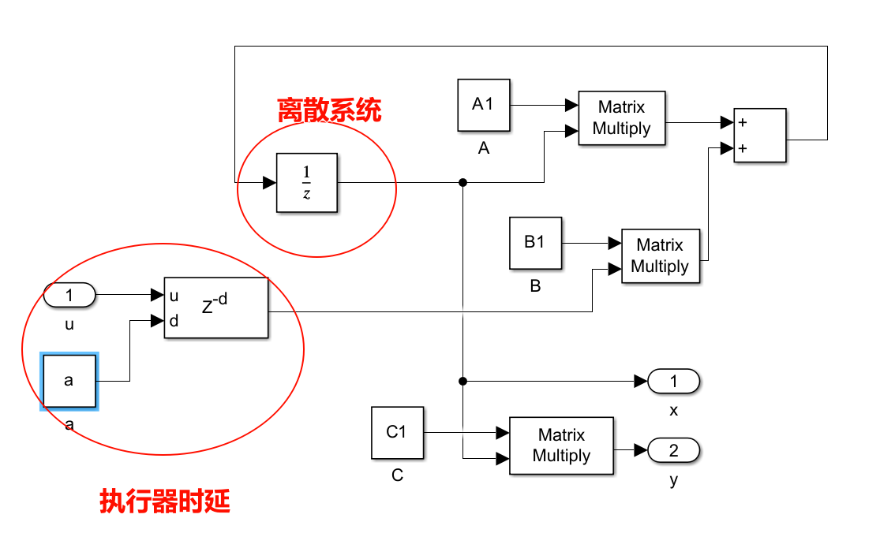
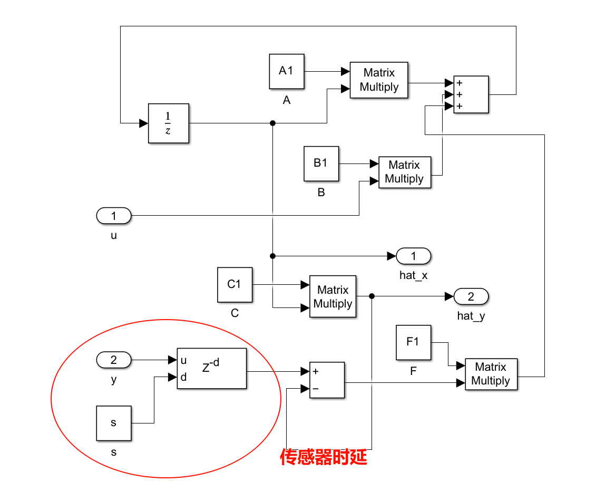
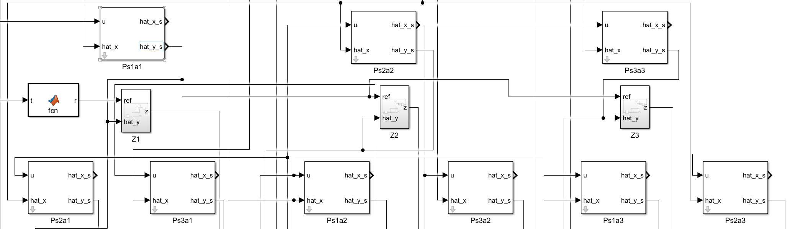
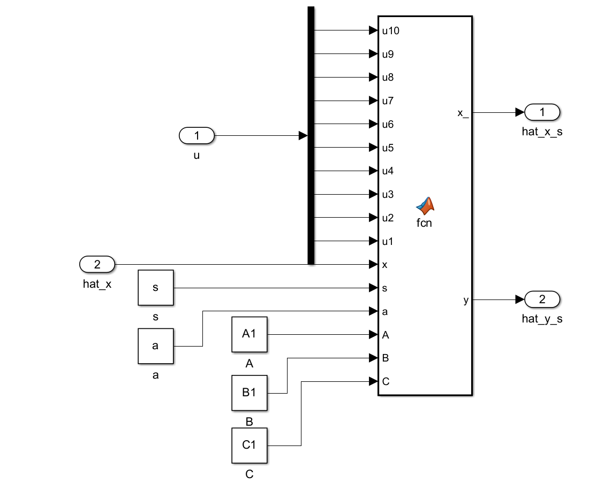
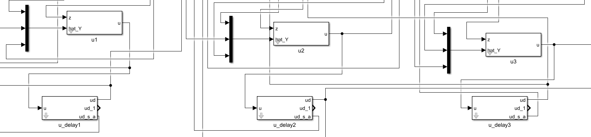
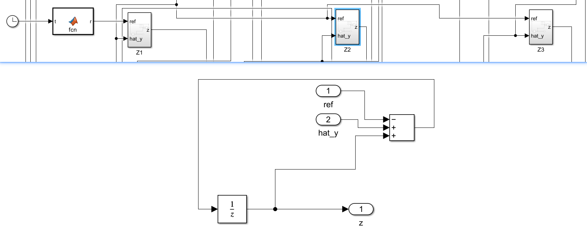
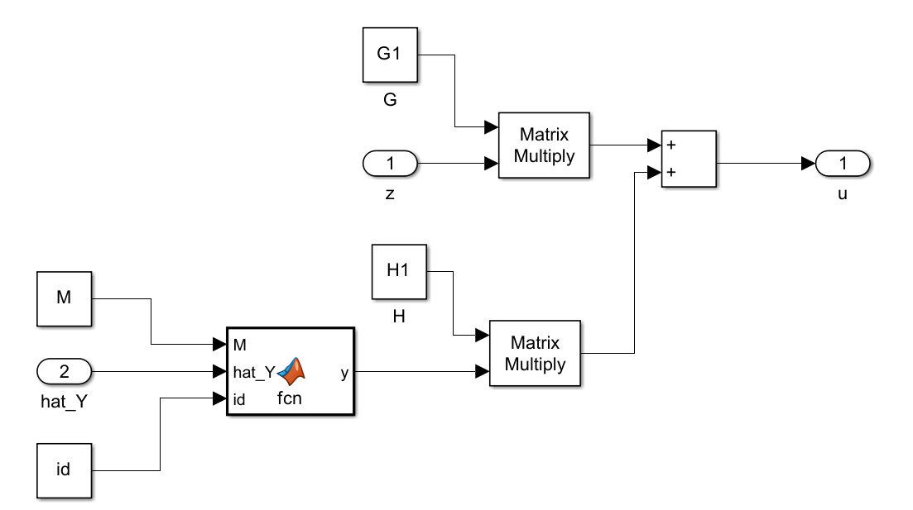
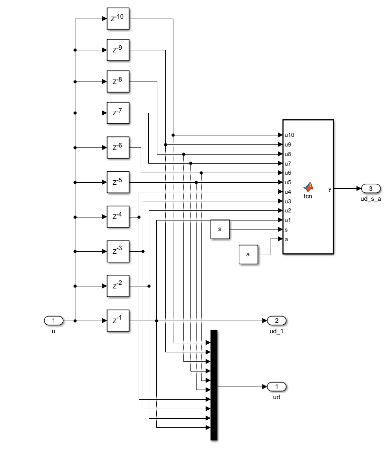
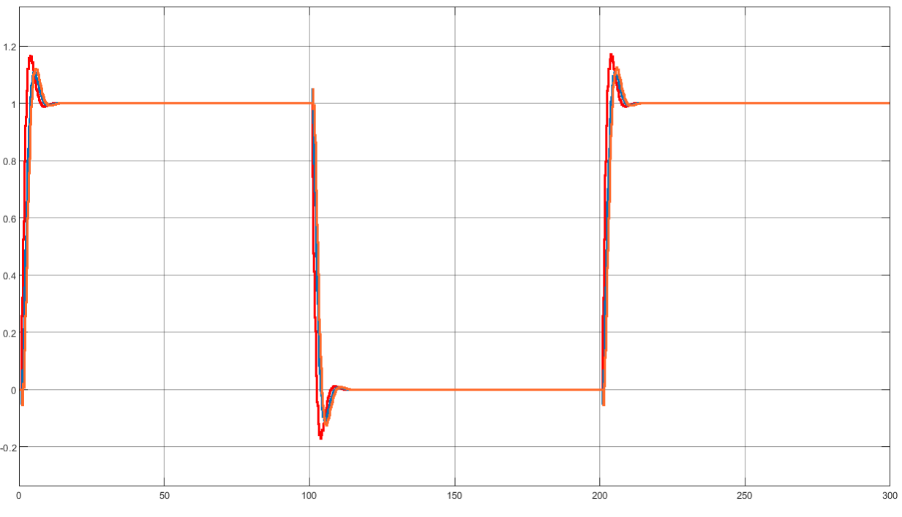
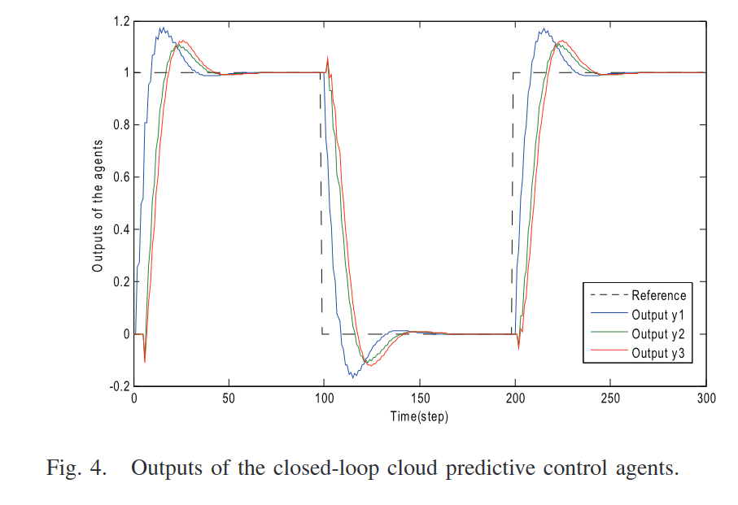

# Predictive Control of Networked Multiagent Systems via Cloud Computing论文复现


## 论文摘要

本文研究了基于云计算的网络化多智能体预测控制系统的设计与分析。该文提出一种网络化多智能体系统（NMAS）云预测控制方案，以同时实现一致性和稳定性，并主动补偿网络时延。详细介绍了NMAS云预测控制器的设计。对云预测控制方案的分析给出了闭环网络化多智能体控制系统稳定性和一致性的必要和充分条件。通过仿真验证了所提方案表征NMAS的动力学行为和控制性能。研究结果为NMAS及其应用的合作和协调控制的发展奠定了基础。

论文链接：[Predictive Control of Networked Multiagent Systems via Cloud Computing | IEEE Journals & Magazine | IEEE Xplore](https://ieeexplore.ieee.org/abstract/document/7822980)

期刊：IEEE Transactions on Cybernetics

分区：Q1

论文引用：G. -P. Liu, "Predictive Control of Networked Multiagent Systems via Cloud Computing," in *IEEE Transactions on Cybernetics*, vol. 47, no. 8, pp. 1852-1859, Aug. 2017, doi: 10.1109/TCYB.2017.2647820.


项目地址:


## 系统参数初始化

```matlab
clc;
clear all;
close all;
A1 = [1.7,-1.3;
     1.6, -1.8
     ];
B1 = [1.0;
      2.0
      ];
C1 = [1.0,0.3];
A2 = [1.8,-1.4;
      1.8,-1.9
      ];
B2 = [1.7;
      3.4
      ];
C2 = [0.7,0.2];
A3 = [1.4,-1.1;
      1.3,-1.5
      ];
B3 = [0.8;
      1.6
      ];
C3 = [1.1,0.4];
G1 = -0.16;
G2 = -0.18;
G3 = -0.14;
H1 = -0.12;
H2 = -0.10;
H3= -0.14;
F1 = [-0.4483;
      -1.1724
      ];
F2 = [-0.6803;
      -1.6191
      ];
F3 = [-0.3908;
      -0.9254
      ];
M = [1,0,1;
    1,1,1;
    1,0,1 
];
X1 =[0.1;
    0.2];
X2 =[0.1;
    0.7];
X3 =[0.1;
    0.8];
samp_t = 0.2
a1 = int8(3);
a2 = int8(2);
a3 = int8(3);
s1 = int8(2);
s2 = int8(3);
s3 = int8(1);


```

## 系统模型

为了说明如何轻松地设计、分析和执行云预测控制方案，下面考虑了线性非同一多智能体。实际上，该方案可以扩展到更一般的 NMAS，例如具有不确定性和干扰的非线性 NMAS

$$
\begin{align} x_{i} (t+1)=&A_{i} x_{i} (t)+B_{i} u_{i} (t) \notag \\ y_{i} (t)=&C_{i} x_{i} (t) \end{align}
$$

 $\forall i  \in  N$
 ，其中 
 $x_i \in R^{n_i}$
 ，
 $y_i \in l$
 ，
 $u_i \in m_i$
 分别是第 
 $i$
 个智能体的状态、输出和输入向量，
 $A_i \in R^{n_i×n_i}$
 ，
 $B_i  \in R^{n_i×m_i}$
 ，
 $C_i  \in R^{l×n_i}$
 是第 i 个智能体的矩阵。



## 观测器

假设所有智能体都是可观察的，但它们的状态是不可测量的。然后，基于输出 
$y_i(t − s_i)$
和控制输入 
$u_i(t − s_i)$
，第 i 个智能体的状态观察器设计如下：

$$
\begin{align} \hat {x}_{i} \left ({t-s_{i} +1 | t-s_{i} }\right )=&A_{i} \hat {x}_{i} \left ({t-s_{i} | t-s_{i} -1}\right )+B_{i} u_{i} \left ({t-s_{i} }\right )\notag \\&+ \,\, F_{i} \left ({y_{i} \left ({t-s_{i} }\right )-\hat {y}_{i} \left ({t-s_{i} | t-s_{i} -1}\right )}\right ) \notag \\ \hat {y}_{i} \left ({t-s_{i} | t-s_{i} -1}\right )=&C_{i} \hat {x}_{i} \left ({t-s_{i} | t-s_{i} -1}\right ) \end{align}
$$

其中 
$\hat {x}_{i} (t-k|t-j)\in \Re ^{n_{i}} (k<j)$
表示第 i 个智能体根据时间 
$t − j$
之前的可用信息对时间 
$t − k$
的状态预测，
$\hat {y}_{i} (.|.)\in \Re ^{l_{i}}$
是输出预测，
$F_{i} \in \Re ^{n_{i} \times l_{i}}$
是观察者增益矩阵。



## 预测过程

要使用直到时间 
$t − s_i$
的可用信息来预测第 i 个智能体的状态，可以使用从 
$t − s_i + 2$
到
$t + a_i$
开始的以下时间状态估计：

$$
\begin{align} \hat {x}_{i} \left ({t-s_{i} +k | t-s_{i} }\right )=&A_{i} \hat {x}_{i} \left ({t-s_{i} +k-1 | t-s_{i} }\right )\notag \\&+ \,\, B_{i} u_{i} \left ({t-s_{i} +k-1}\right ) \\ \hat {y}_{i} \left ({t-s_{i} +k | t-s_{i} }\right )=&C_{i} \hat {x}_{i} \left ({t-s_{i} +k | t-s_{i} }\right ) \end{align}
$$

传感器时延部分的预测+执行器部分的预测：





预测部分代码：

```matlab
function [x_,y]= fcn(u10,u9,u8,u7,u6,u5,u4,u3,u2,u1,x,s,a,A,B,C)
% tau的上界是N,最多迭代N次，控制输入按照t-s_i时刻的值
tau = s + a;
temp0 = x;
if tau == 1
    temp1 = A * temp0 + B * u1;
    x_ = temp1;
elseif tau == 2
    temp1 = A * temp0 + B * u2;
    temp2 = A * temp1 + B * u1;
    x_ = temp2;
elseif tau == 3
    temp1 = A * temp0 + B * u3;
    temp2 = A * temp1 + B * u2;
    temp3 = A * temp2 + B * u1;
    x_ = temp3;
elseif tau == 4
    temp1 = A * temp0 + B * u4;
    temp2 = A * temp1 + B * u3;
    temp3 = A * temp2 + B * u2;
    temp4 = A * temp3 + B * u1;
    x_ = temp4;  
elseif tau == 5
    temp1 = A * temp0 + B * u5;
    temp2 = A * temp1 + B * u4;
    temp3 = A * temp2 + B * u3;
    temp4 = A * temp3 + B * u2;
    temp5 = A * temp4 + B * u1;
    x_ = temp5;
elseif tau == 6
    temp1 = A * temp0 + B * u6;
    temp2 = A * temp1 + B * u5;
    temp3 = A * temp2 + B * u4;
    temp4 = A * temp3 + B * u3;
    temp5 = A * temp4 + B * u2;
    temp6 = A * temp5 + B * u1;
    x_ = temp6;
elseif tau == 7
    temp1 = A * temp0 + B * u7;
    temp2 = A * temp1 + B * u6;
    temp3 = A * temp2 + B * u5;
    temp4 = A * temp3 + B * u4;
    temp5 = A * temp4 + B * u3;
    temp6 = A * temp5 + B * u2;
    temp7 = A * temp6 + B * u2;
    x_ = temp7;
elseif tau == 8
    temp1 = A * temp0 + B * u8;
    temp2 = A * temp1 + B * u7;
    temp3 = A * temp2 + B * u6;
    temp4 = A * temp3 + B * u5;
    temp5 = A * temp4 + B * u4;
    temp6 = A * temp5 + B * u3;
    temp7 = A * temp6 + B * u2;
    temp8 = A * temp7 + B * u1;
    x_ = temp8;
elseif tau == 9
    temp1 = A * temp0 + B * u9;
    temp2 = A * temp1 + B * u8;
    temp3 = A * temp2 + B * u7;
    temp4 = A * temp3 + B * u6;
    temp5 = A * temp4 + B * u5;
    temp6 = A * temp5 + B * u4;
    temp7 = A * temp6 + B * u3;
    temp8 = A * temp7 + B * u2;
    temp9 = A * temp8 + B * u1;
    x_ = temp9;
elseif tau == 10
    temp1 = A * temp0 + B * u10;
    temp2 = A * temp1 + B * u9;
    temp3 = A * temp2 + B * u8;
    temp4 = A * temp3 + B * u7;
    temp5 = A * temp4 + B * u6;
    temp6 = A * temp5 + B * u5;
    temp7 = A * temp6 + B * u4;
    temp8 = A * temp7 + B * u3;
    temp9 = A * temp8 + B * u2;
    temp10 = A * temp9 + B * u1;
    x_ = temp10;
else 
    x_ = temp0;

end
y = C * x_;


```


## 控制器设计



假设所需的参考输入由阶跃信号向量 $r_0$ 表示，并且仅应用于其中一个智能体，例如，具有
$a_1 ≥ a_i， \forall i  \in  N − {1}$
的第一个智能体。为了跟踪这个所需的参考输入，引入了一组动态变量

$$
\begin{align} z_{1} \left ({t+1+a_{1}}\right )=&z_{1} \left ({t+a_{1}}\right )+\hat {y}_{1} \left ({t+a_{1} | t-s_{1} }\right )-r_{0}\qquad \\ z_{i} \left ({t+1+a_{i} }\right )=&z_{i} \left ({t+a_{i}}\right )+\hat {y}_{i} \left ({t +a_{i} | t-s_{i} }\right )\notag \\&- \,\, \hat {y}_{1} \left ({t +a_{i} | t- s_{1} }\right ). \end{align}
$$

(5)和(6)中动态变量的作用相当于常规控制系统中的积分作用，可以消除稳态跟踪误差。



为了主动补偿网络延迟 
$s_i$
和 
$a_i， \forall i  \in  N$
，NMAS 的预测控制协议如下：

$$
\begin{align} \hat {u}_{i} \left ({t+a_{i} | t-s_{i} }\right )=&G_{i} z_{i} \left ({t+a_{i} }\right )\notag \\&+ \,\, H_{i} \sum _{j=1}^{N}c_{ij} \Biggl ({\hat {y}_{j} \left ({t+a_{i} | t-s_{j} }\right )}\notag \\&\qquad \qquad \qquad {- \,\, \hat {y}_{i} \left ({t+a_{i} | t-s_{i} }\right )}\Biggr )\qquad \end{align}
$$

其中

$$
\begin{equation} c_{ij} =\begin{cases} {1}, & {\mathrm{ if}}~a_{i} \, \le \, a_{j}\\ {0},& {\mathrm{ if}}~a_{i} \, >a_{j}. \end{cases} \end{equation}
$$

$G_i  \in R^{m_i×m_i}$ 和 $H_i  \in R^{m_i×l_i}$
是需要设计的增益矩阵。以上暗示预测控制协议利用基于时间 
$t − s_i, \forall i  \in  N$
可用信息的输出预测来估计时间 
$t + a_i, \forall i  \in  N$
的未来控制行为。实际上，所提出的预测控制协议由两部分组成。一个是让智能体 1 跟踪所需的参考，让其他智能体跟踪智能体 1 的输出，这由 (7) 中右侧的第一项表示。另一个是智能体之间的协调，由（7）中右侧的第二项表示。



然后，第 i 个智能体的预测控制输入被设计为

$$
\begin{equation} u_{i} \left ({t+a_{i}}\right )=\hat {u}_{i} \left ({t+a_{i} | t-s_{i}}\right ). \end{equation}
$$

因此，第 i 个智能体的控制输入为

$$
\begin{equation} u_{i} (t)=\hat {u}_{i} \left ({t | t-s_{i} -a_{i}}\right ). \end{equation}
$$




因此，云预测控制方案被提出如下。

1. 来自传感器的所有智能体的输出数据
$y_i(t), \forall i  \in  N$
, 在每个采样时间 t 被发送到网络。 

2. 基于从网络接收到的输出数据 $y_i(t − s_i), \forall i  \in  N$，云计算系统计算预测$\hat {x}_{i} (t+a_{i} |t-s_{i} ),~\hat {y}_{i} (t+a_{i} |t-s_{i} ),~\hat {u}_{i} (t+a_{i} |t-s_{i} ),~\forall i\in {\mathbb N},$, 分别使用（3），（4）和（7）的智能体的状态，输出和控制输入，和动态变量$z_{i}(t+a_{i})$, $ \forall i  \in  N$ 使用 (5) 和 (6)。 

3. 由(9)给出的控制输入预测$u_{i} (t+a_{i}), \forall i  \in  N$通过网络从云计算系统发送到每个智能体的执行器。 

4. 所有智能体的执行器在每个采样时间 t 从网络接收由 (10) 给出的控制输入 $u_i(t),  \forall i  \in  N$。

   

## 仿真结果

基本符合原文结果。



原文结果：



[论文复现：PredictiveControlofNetworkedMultiagentSystemsviaClou资源-CSDN文库](https://download.csdn.net/download/qq_30759585/89557011)
